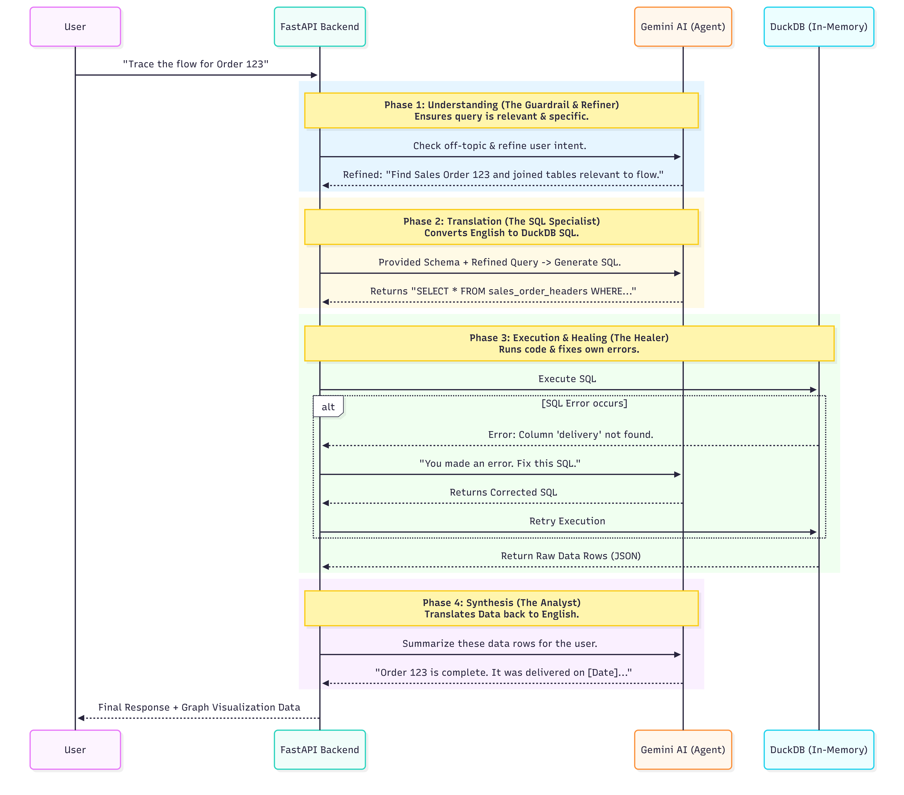

# Order-to-Cash Graph Explorer

A context graph system with an LLM-powered natural language query interface for SAP Order-to-Cash data.

**Live Demo:** [chat-with-graph.vercel.app](https://chat-with-graph.vercel.app)


---

##  What It Does

- **Ingests SAP O2C Data:** Loads JSONL files (Sales Orders, Deliveries, Billing, etc.) directly into an in-memory DuckDB database (no ETL required).
- **Graph Visualization:** Constructs an interactive 3D force-directed graph of ~600 nodes and ~691 edges using `react-force-graph-3d`.
- **Conversational Querying:** Uses **Gemini 2.5 Flash** to translate natural language into SQL, execute it against the data, and return grounded answers.
- **Visual Feedback:** Automatically highlights graph nodes that are referenced in the chat response.

---

##  Architecture


### Tech Stack

- **Frontend:** React, Vite, Tailwind CSS, `react-force-graph-3d`
- **Backend:** Python, FastAPI, Uvicorn
- **Database:** DuckDB (In-Memory OLAP)
- **AI/LLM:** Google Gemini 2.5 Flash
- **Deployment:** 
  - Backend: **Docker** + **Google Cloud Run** (Serverless Container)
  - Frontend: **Vercel** (Global Edge Network)

---

##  Why These Choices?

### DuckDB (In-Memory)
Selected for its ability to treat the raw JSONL dataset as a database without a complex ingestion pipeline. `read_json_auto` allows us to create Virtual Views over the files instantly. It supports complex analytical SQL (Joins, Window Functions, Aggregations) that simple graph traversals often struggle with.

### Gemini 2.5 Flash
Chosen for its **speed and large context window**. We inject the entire database schema (~3KB of context) into the prompt, allowing the model to "understand" the rigid SAP data structure accurately. The multi-step agent flow exploits its low latency for a snappy user experience.

### React Force Graph 3D
Order-to-Cash data is highly interconnected. A 3D view efficiently spatializes dense clusters (like "Customer" nodes linked to 50+ orders) that would otherwise clutter a 2D canvas, improving navigability.

---

## Guardrails & Prompt Strategy

To prevent hallucinations and misuse, we implemented a strict **Chain-of-Thought** pipeline:

1.  **Intent Guard:** A dedicated LLM call classifies user input. Questions about "creative writing" or "general knowledge" are rejected immediately.
2.  **Schema Enforcement:** The "SQL Generation" prompt includes a list of **Forbidden Aliases** (e.g., *never use `delivery_items`, use `outbound_delivery_items`*) to handle SAP's nuanced naming conventions.
3.  **Read-Only Execution:** The database is strictly read-only. The backend rejects any SQL command that isn't a `SELECT`.
4.  **Grounded Answers:** The final answer is synthesized *only* from the SQL result rows, not from the LLM's training data.

---

## 💻 Local Setup

```bash
# 1. Backend Setup
cd backend
pip install -r requirements.txt
# Ensure 'sap-o2c-data' folder is present in backend/
export GEMINI_API_KEY="your_api_key_here"
uvicorn main:app --reload

# 2. Frontend Setup
cd frontend
npm install
export VITE_API_BASE_URL="http://localhost:8000"
npm run dev
```

---

## 🔍 Example Queries to Try

- *"Trace the complete flow for Billing Document 90504248"*
- *"Which products have the most cancellations?"*
- *"Show me all sales orders that have been delivered but not yet billed (broken flow)"*
- *"Identify the top 5 customers by total order volume"*
